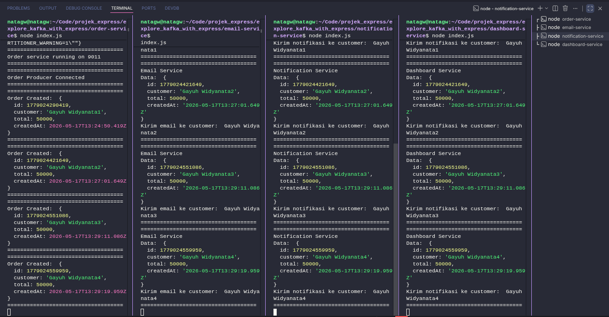

# Explore Kafka dengan Express

Project ini adalah contoh sederhana penggunaan Apache Kafka dengan beberapa service Express.js.

Alurnya:

1. `order-service` menerima request pembuatan order.
2. `order-service` mengirim event ke topic Kafka `order.created`.
3. `email-service`, `notification-service`, dan `dashboard-service` membaca event tersebut sebagai consumer.
4. Setiap consumer menampilkan data order di terminal masing-masing.

## Struktur Folder

```text
.
├── dashboard-service
├── email-service
├── notification-service
├── order-service
├── docker-compose.yml
└── img
    └── doc1.png
```

## Kebutuhan

Pastikan sudah terinstall:

- Node.js
- npm
- Docker
- Docker Compose

## Menjalankan Kafka dengan Docker

Jalankan perintah ini dari folder utama project:

```bash
docker compose up -d
```

Perintah tersebut akan menjalankan Kafka di port `9092`.

Untuk mengecek container Kafka:

```bash
docker ps
```

Untuk melihat log Kafka:

```bash
docker compose logs -f kafka
```

Untuk menghentikan Kafka:

```bash
docker compose down
```

## Install Dependency Tiap Service

Masuk ke masing-masing folder service, lalu jalankan `npm install`.

### Order Service

```bash
cd order-service
npm install
```

### Email Service

```bash
cd email-service
npm install
```

### Notification Service

```bash
cd notification-service
npm install
```

### Dashboard Service

```bash
cd dashboard-service
npm install
```

Kalau sudah pernah install dan folder `node_modules` sudah ada, langkah ini tidak perlu diulang.

## Menjalankan Service

Buka beberapa terminal terpisah agar setiap service bisa terlihat log-nya.

### Terminal 1: Jalankan Kafka

Dari folder utama project:

```bash
docker compose up -d
```

### Terminal 2: Jalankan Order Service

```bash
cd order-service
node index.js
```

Service ini berjalan di:

```text
http://localhost:9011
```

### Terminal 3: Jalankan Email Service

```bash
cd email-service
node index.js
```

Service ini berjalan di:

```text
http://localhost:9012
```

### Terminal 4: Jalankan Notification Service

```bash
cd notification-service
node index.js
```

Service ini berjalan di:

```text
http://localhost:9013
```

### Terminal 5: Jalankan Dashboard Service

```bash
cd dashboard-service
node index.js
```

Service ini berjalan di:

```text
http://localhost:9014
```

## Contoh Hit API

Setelah Kafka dan semua service berjalan, buat order baru dengan `curl` berikut:

```bash
curl -X POST http://localhost:9011/order \
  -H "Content-Type: application/json" \
  -d '{
  "customer":"Gayuh Widyanata4",
  "total":50000
}'
```

Jika berhasil, response dari `order-service` kurang lebih seperti ini:

```json
{
  "message": "Order berhasil dibuat",
  "data": {
    "id": 1710000000000,
    "customer": "Gayuh Widyanata4",
    "total": 50000,
    "createdAt": "2026-05-17T00:00:00.000Z"
  }
}
```

Nilai `id` dan `createdAt` akan berbeda sesuai waktu request dibuat.

## Hasil yang Terlihat di Terminal

Setelah request berhasil dikirim:

- Terminal `order-service` akan menampilkan log `Order Created`.
- Terminal `email-service` akan menampilkan data order dan simulasi kirim email.
- Terminal `notification-service` akan menampilkan data order dan simulasi kirim notifikasi.
- Terminal `dashboard-service` akan menampilkan data order untuk dashboard.

Contoh hasil terminal lokal:



## Ringkasan Port

| Service | Port | Fungsi |
| --- | --- | --- |
| Kafka | `9092` | Message broker |
| Order Service | `9011` | Producer, menerima request order |
| Email Service | `9012` | Consumer untuk simulasi email |
| Notification Service | `9013` | Consumer untuk simulasi notifikasi |
| Dashboard Service | `9014` | Consumer untuk simulasi dashboard |

## Catatan Penting

- Kafka harus berjalan sebelum service Node.js dijalankan.
- Semua service menggunakan broker Kafka `localhost:9092`.
- Topic Kafka yang digunakan adalah `order.created`.
- `docker-compose.yml` pada project ini hanya menjalankan Kafka, bukan semua service Node.js.
- Kalau service gagal connect ke Kafka, pastikan container Kafka sudah aktif dengan `docker ps`.
